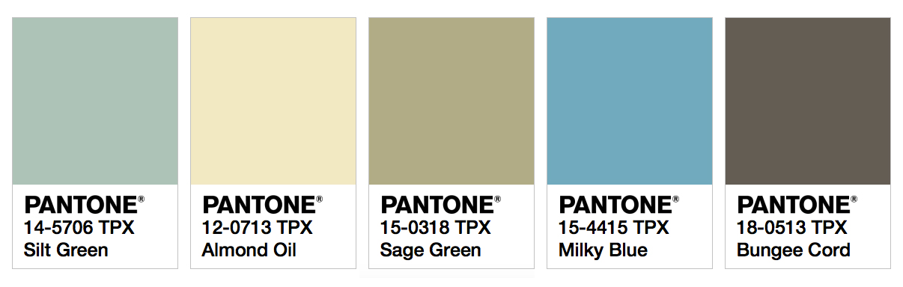

<!DOCTYPE html>
<html lang="en">
  <head>
    <meta charset="utf-8">
    <meta name="viewport" content="width=device-width, initial-scale=1">
    <meta name="author" content="Justine Evans">
    <meta name="description" content="A Basic HTML Template">
    <h1>Read Me Project 3</h1>
  </head>
  <body>
  <h3>Part 1</h3>
  1. I am going to do a book showcase.  
  2. I chose the book, Where the Sidewalk ends by Shel Silverstein.   Here is my writing sample:  
 
  The Edge of The World
    
  Columbus said the world was round? 
  Don't you believe a word of that. 
  For I've been down to the edge of the world, 
  Sat on the edge where the wild wind whirled, 
  peeked over the ledge where the blue smoke curls, 
  And I can tell you, boys and girls, 
  The world is FLAT!
    3. This author is very talented. He wrote several books of prose and poetry. He also writes songs, draws cartoon, sings, and plays guitar.  
    
  4. Here is my color pallette:
   
  
   
   
  5. Here is an ispirational image from the front cover of the book:  
  
<h3>Part 2</h3>
For this part of the project I did a lot of thinking about the design and layout for my site. I picked out two fonts that should fit nicely together, Ubuntu and DancingScipt. I still really like the color pallette I chose and think it would be great for a children's site. I don't think I will want to use all of those colors though. I as likely going to leave out the sage green. The almond oil color looks like it could be a good subtle background color. and the Gray color used for text.
I seemed to have some issues with using color. I followed the directions and it didn't always work. I did the background color fine but doing text color didn't work so well.
  </body>
</html>
